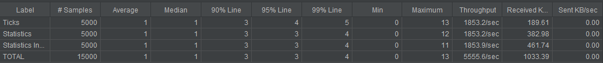

# Using JArchitect to analyze 

## *ShiftHunter* Instruments Project*.

 - ShiftHunter, as one of the leading providers of financial indexes, 
 consumes and uses real-time trading prices of tens of thousands of 
 financial instruments from more than 100 exchanges over the world.

 - In order to ensure integrity of our index calculation and proper input data, 
 our operations team needs a restful API to monitor the incoming prices. 
 
 The main use case for that API is to provide real-time price statistics from 
 the last 60 seconds (sliding time interval).

There will be three APIs:
* The first one is called every time we receive a tick. It is also the sole input of this rest API.
* The second one returns the statistics based on the ticks of all instruments of the last 60 seconds
(sliding time interval)
* The third one returns the statistics based on the ticks of one instrument of the last 60 seconds
(sliding time interval).

### All APIs might be called in parallel. Notably; 

* POST "/ticks" might be continuously called before the previous /ticks where finished.

### Specifications

#### POST /ticks
Every time a new tick arrives, this endpoint will be called. Body:
```
{
"instrument": "IBM.N",
"price": 143.82,
"timestamp": 1478192204000
}
```
** where:
*• instrument - a financial instrument identifier (string; list of instruments is not known to our service in
advance so we add them dynamically)
*• price - current trade price of a financial instrument (double)
*• timestamp - tick timestamp in milliseconds (long; this is not current timestamp)
Returns: Empty body with either 201 or 204:
*• 201 - in case of success
*• 204 - if tick is older than 60 seconds

#### GET /statistics
* This is the endpoint with aggregated statistics for all ticks across all instruments, this endpoint has to
execute in constant time and memory (O(1)).
* It returns the following statistics based on the ticks which happened in the last 60 seconds (sliding time
interval).

Returns:
```
{
"avg": 100,
"max": 200,
"min": 50,
"count": 10
}
```
where:
* avg is a double specifying the average amount of all tick prices in the last 60 seconds
* max is a double specifying single highest tick price in the last 60 seconds
* min is a double specifying single lowest tick price in the last 60 seconds
* count is a long specifying the total number of ticks happened in the last 60 seconds

#### GET /statistics/{instrument_identifier}
* This is the endpoint with statistics for a given instrument.

It returns the statistic based on the ticks with a given instrument identifier happened in the last 60 seconds
(sliding time interval). 
The response is the same as for the previous endpoint but with instrument specific statistics.

#### Requirements & Comments

* We kindly ask you not to use standard libraries for statistic calculation or aggregation
* Please implement an in-memory solution. Don’t use any kind of database
* Please pay attention to the code quality of your solution, as you would do in your daily work
* Please provide test coverage as you deem appropriate and necessary – as you would do in your
daily work

* GET /statistics should execute in constant time
* GET /statistics/{instrument_identifier} should execute in constant time
* The APIs have to be safe against concurrent requests
* The APIs should be able to deal with time discrepancy, which means, at any point of time, we could receive a tick which have a timestamp in the past

JArchitect First Analisys

JArchitect Report

[](http://www.wservices.co.uk/geolocalization/NDependOut/NDependReport.html)

DASHBOARD:


QUERIES AND RULES


# Instructions for the RestController version Java 11

1. **mvn clean package**

2. Starting the application: 
	* 2.a 
		**mvn spring-boot:run** 
		or 
		**java -jar target/solactive-real-time-restcontroller.jar**

	* 2.b Monitoring wiht [Javamelody](http://localhost:8081/monitoring).
	
	* 2.c **Rest APIs** running on port: **8081**
		
	* All requests paths: ("**/ticks**", "**/statistics**", "**/statistics/{instrument}**")
		*	http://localhost:8081/ticks
		*	http://localhost:8081/statistics
		*	http://localhost:8081/statistics/{instrument}
	
3. Execute JMeter to Performe Multiple Performance Tests.

* 3.a Download and Install JMeter
	* [JMeter Performance Test Tool](https://jmeter.apache.org/download_jmeter.cgi)

* 3.b Under the folder: **"Jmeter_Performance"**, 
	* Open the JMeter project **"Solactive_Tests_RestController.jmx"**

* 3.c Executing some tests
	* The JMeter project has a file atached with 5000 (**Instruments-for-Tests**) with random prices
	* You can generate at any time nem instruments: Java Class **InstrumentsGenerator.java**
	```java
	
		public class InstrumentsGenerator {

			/**
			 * BaseInstrument: enum.
			 */
			private enum BaseInstrument {
				DISNEY_US("DISNEY.US"), EBAY_US("EBAY.US"), NFLX_US("NFLX.US"), 
				PEPSI_US("PEPSI.US"), SNAP_US("SNAP.US"), SBUX_US("SBUX.US"),
				TESLA_US("TESLA.US"), TWTR_US("TWTR.US"), WMT_US("WMT.US"), 
				LMT_US("LMT.US"), APA_US("APA.US"), IBM_N("IBM.N");
				...

	```
	* The JMeter project will generate random epochs with 80 seconds down and up from current time:
	* This Interval enables to test HttpStatus response codes: **201**, **204** and **400**
	* JMeter Random Variable used: 
		* **Random Datetime**
			```
			${__timeShift(,curTime,-PT80S,,)} 
			 and 
			${__timeShift(,curTime,PT80S,,)}
			```
	* Generating JMeter HTML Reports:
		* Execute the first script on the file **Scripts-JMeter.md**
		* After the script finishes open the **index.html** under the folder **JMeter-Reports-Solactive**
		* JMeter result of the tests **throughput:**
		
		
* 3.d I decided to implement a third rule for "Ticks greater than current time":
	* Rules: 
		* 1) Ticks less than 60 seconds from current time: response 201 
		* 2) if tick is older than 60 seconds from current time: response 204 
		* 3) **Ticks 60 seconds greater than current time: response 400 (extra rule)**		

4. Import PostMan file from the folder **"PostMan_Requests"** 
	- Execute as you wish the requests:
		* Executor Multhreading Ticks: 
		>"/ticks" -> **To insert one Instrument**

		* Executor Multhreading Statistics
		>"/statistics" -> **Get statistics of all Instruments**

		* Executor Multhreading Statistics Instrument
		>"/statistics/{instrument}" -> **Get the statistics from an instrument**
		
		* Online tool for verifying Epochs:
		[Epoch OnLine tool](https://www.freeformatter.com/epoch-timestamp-to-date-converter.html)
			
## Improvements 
 -	One technique to be discussed is the use of Chaching strategies, 
	which would be a more sophisticated implementation. 
	
	**The critical point to be solved is the TimeStamp**. 
	
	At some point, we could use Cache with the future implementation of some instruments, 
	and compute only instruments with different prices.
	
	This would be a way of thinking outside the box!
	
	Another improvement is:
	Use of tools such as Redis, Ignite or 
	Spring Caching pure and/or with caffeine.
	* Caching tool: 
	[Caffeine Camel](https://camel.apache.org/components/latest/caffeine-cache-component.html)


### Troubleshooting or misc.	

#### Use of Optional with Stream
* Sample Stream implementation without "Optional" (Implemented)
```
// lowest tick price in the last 60 seconds (Without Optional)
TicksDTO minPrice = mappedTick.values().stream()
	.collect(Collectors.minBy(Comparator.comparingDouble(TicksDTO::getPrice))).get();
```
* Sample Stream implementation using "Optional"
```
// lowest tick price in the last 60 seconds (With Optional)
List<TicksDTO> minPrice = mappedTick.values().stream()
		.collect(Collectors.groupingBy(TicksDTO::getPrice, Collectors.minBy(comparatorPrice)))
		.values().stream().map(Optional::get).collect(Collectors.toList());	
```		
		
		
	